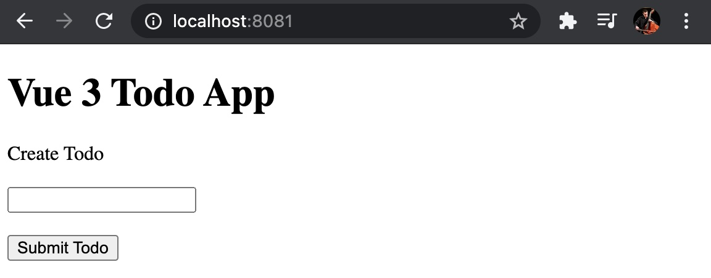
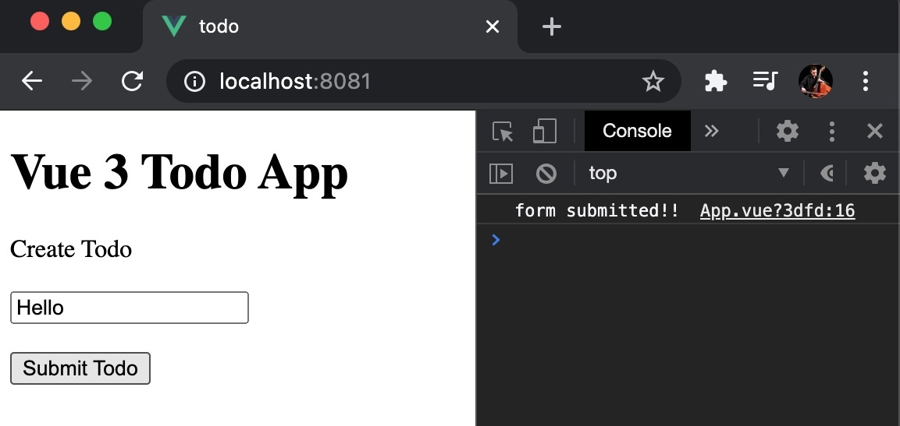
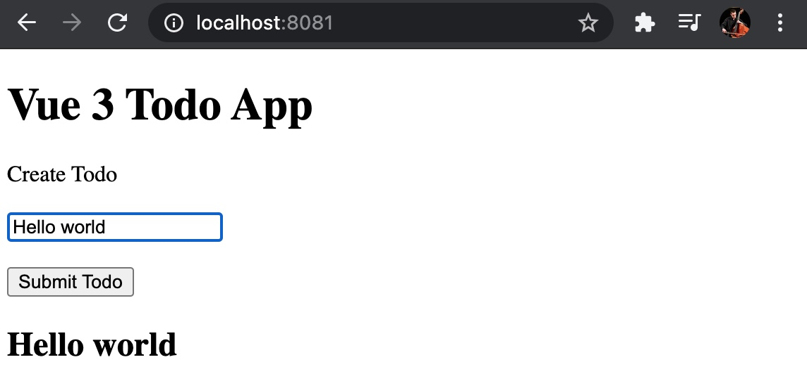
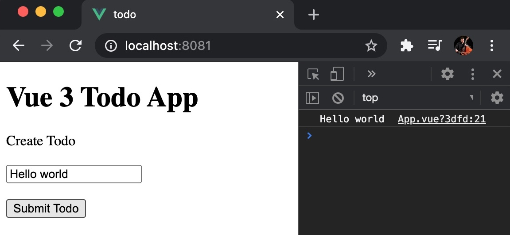
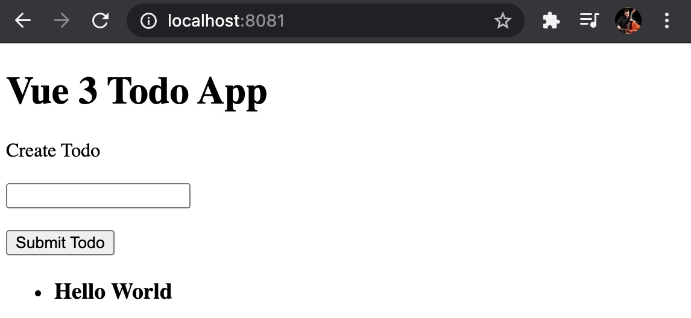
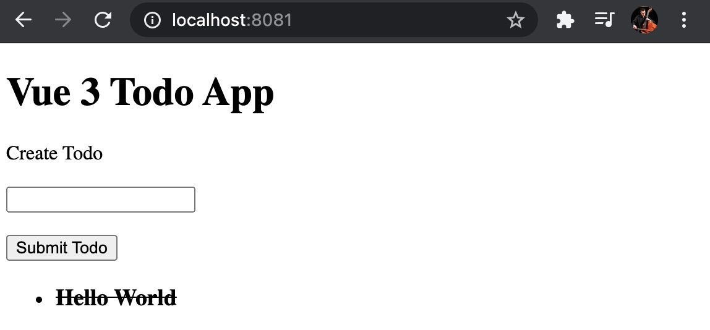

# vue3-todo

This project is based on the excellent video [Intro to Vue 3 + Composition API: Build a Todo App](https://www.youtube.com/watch?v=rncY1tlWShM) by [Coding Garden with CJ](https://www.youtube.com/channel/UCLNgu_OupwoeESgtab33CCw).

## Setup

```
vue create vue3-todo
cd vue3-todo
yarn serve
```

```html
<template>
  <h1>Vue 3 Todo App</h1>
</template>

<script>
export default {

}
</script>
```

## Create New Todo Form

```html
<template>
  <h1>Vue 3 Todo App</h1>
  <form @submit="addNewTodo">
    <label>Create Todo</label>
    <br><br>
    <input name="newTodo">
    <br><br>
    <button>Submit Todo</button>
  </form>
</template>
```



## Call a function when the form is submitted

```html
<form @submit.prevent="addNewTodo">
```

```javascript
export default {
  setup() {
    const addNewTodo = () => {
      console.log('form submitted!!')
    }
    return {
      addNewTodo,
    }
  }
}
```



## Create a string property to store the user input

```javascript
import { ref } from 'vue'

export default {
  setup() {
    const newTodo = ref('');

    return {
      newTodo,
    }
  }
}
```

```html
<input v-model="newTodo" name="newTodo">
```

### Watch the property change as we type in the input

```html
<h2>{{newTodo}}</h2>
```



## Log the user input when the form is submitted

```javascript
const addNewTodo = () => {
  console.log(newTodo.value)
}
```



## Create an array property for todos

```javascript
export default {
  setup() {
    const todos = ref([])

    return {
      todos,
    }
  }
}
```

## Push the new todo into the todos array

```javascript
const addNewTodo = () => {
  todos.value.push({
    id: Date.now(),
    done: false,
    content: newTodo.value,
  })
  newTodo.value = ''
}
```

## Show the todos in a list

```html
<ul>
  <li v-for="todo in todos" v-bind:key="todo.id">
    <h3>{{todo.content}}</h3>
  </li>
</ul>
```



## Check done on a todo to mark it as done

```html
<h3 @click="toggleDone(todo)">{{todo.content}}</h3>
```

```javascript
const toggleDone = (todo) => {
  todo.done = !todo.done
}

return {
  toggleDone,
}
```

### Show a line through the todo text

```html
<style>
.done {
  text-decoration: line-through;
}
</style>
```

```html
<h3 :class="{ done: todo.done }" @click="toggleDone(todo)">
  {{todo.content}}
</h3>
```



## Add a button to delete a todo

## Add a button to mark all todos as done